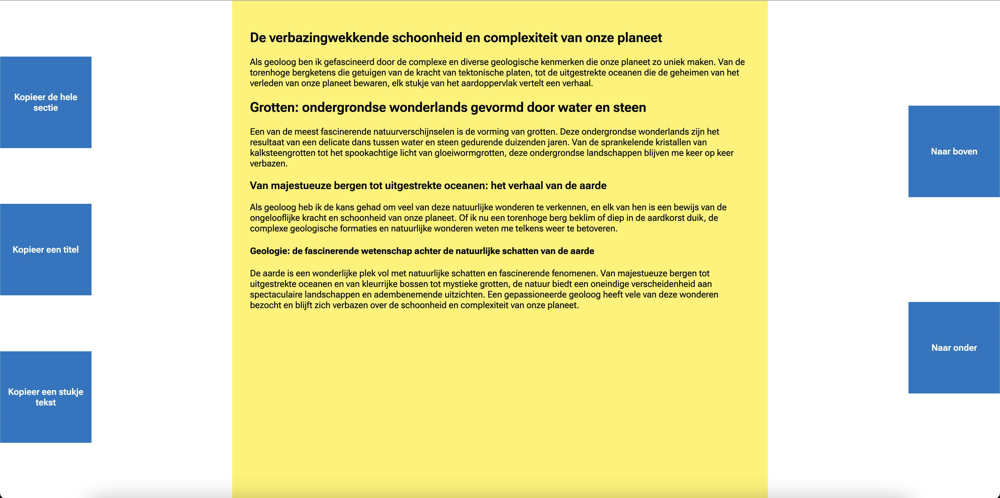

# Human Centered Design @cmda-minor-web 2022 - 2023

## Ontwerpen voor Nicolette Besemer
Voor het vak Human Centered Design is mij de taak gegeven om te ontwerpen voor een persoon. Bij CMD hebben wij vaak geleerd om bij het designen van een media-uiting rekening te houden met verschillende doelgroepen, het is nu een keer anders en ik heb juist heel specifiek voor 1 persoon iets mogen ontwerpen. En voor mij was de taak om dit voor Nicolette Besemer te doen.

## Onderzoeksvraag
### Tijdens deze 3 weken heb ik mijzelf veel vragen gesteld, hiervan was de meest belangrijke:
> Hoe kan ik ervoor zorgen dat Nicolette tekst kan kopiëren zonder het gebriuk van een muis?

## Waar loopt Nicolette eigengelijk tegenaan?
Nicolette is een vrouw van 76 jaar. Ze heeft gewerkt bij de gemeente Amsterdam waar zij zich inzette voor gehandicapten. Het bedienen van apparaten gaat helaas heel moeizaam voor haar, ze lijd aan Axonale polyneuropathie wat betekent dat zij beperkt gebruik kan maken van haar ledematen. Hierdoor zit ze in een rolstoel en gebruikt ze tools zoals een laptop die afgesteld is naar haar wens. Deze heeft bijvoorbeeld een mappenstructuur in detailmodus met checkboxes naast mappen, een tekentablet tablet in plaats van een muis en spraaksoftware om het gebruik van haar laptop toch nog iets makkelijker te maken. 

Bij het gebruik van haar laptop is het voornaamste probleem dat zij heeft het lang scrollen. Ook vind zij het selecteren van tekst op pagina's moeilijk, daarom zou zij graag een oplossing zien die ervoor zorgt dat het kopieren en plakken van tekst nog makkelijker maakt, en wil zij makkelijk kunnen scrollen op paginas waarbij zij het liefst geen lange bewegingen hoeft te maken.

## Oplossing
In de afgelopen weken heb ik een aantal keer mijn prototypes getest met Nicolette. Hierbij heb ik een een paar belangrijke punten opgemerkt die ik heb meegenomen in mijn uiteindelijke ontwerp.

##### Niet meer lang hoeven scrollen
Uit de eerste week bleek dat Nicolette het lange scrollen het meest in de weg zat bij het gebruik van haar computer/interface. Hierom heb ik dit lange scrollen proberen op te lossen met twee vrij grote buttons in de interface aan de rechterkant, een om een pagina naar boven te gaan en een om een pagina naar beneden te navigeren. Hierdoor hoeft ze zelf niet meer te scrollen of de scrollbalk te gebruiken en kan ze zich door de interface heen klikken.

##### Niet meer hoeven te "mikken" door grote knoppen
Door het maken van een grote interface kan Nicolette moeilijk meer een knop missen. Zij gaf aan dat het vaak moeilijk is om een apparaat te bedienen omdat ze dan moet "mikken". Dit betekent dat ze dan haar arm/hand aanzet om een bepaalde cirkel beweging te maken om een element te selecteren. Door grote knoppen te maken in de interface zijn deze niet meer te missen en dus is het makkelijker navigeren door een document/pagina.

###### Gemaakt prototype

- Link naar mijn prototype: https://bram-ter.github.io/human-centered-design-2223/

## Onderzoek en documentatie

Mijn onderzoek en documentatie is te vinden in mijn [wiki](https://github.com/Bram-ter/human-centered-design-2223/wiki)
